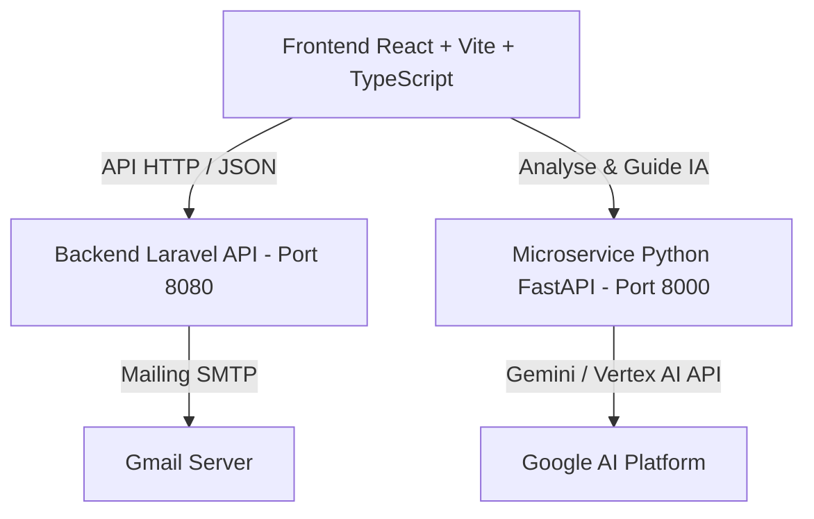

# 🚀 Planora (SprintAI) - Plateforme Intelligente de Gestion de Projets par IA


> **Planora** est une solution complète de gestion de projet assistée par Intelligence Artificielle. Elle transforme n'importe quel cahier des charges (fichiers PDF, Word, texte brut) en **User Stories**, **sous-tâches techniques**, **estimations temporelles**, **plannings de Sprints**, **Tableau Kanban** et **Diagramme de Gantt**.

---

## ✨ Fonctionnalités Clés

### 🧠 1. Découpage Automatique par IA (Cahier des Charges)
- **Importation 1-Page :** Déposez simplement un cahier des charges (`.pdf`, `.docx`, `.txt`) ou collez votre texte directement.
- **Analyse Instantanée :** L'IA extrait automatiquement l'ensemble des modules, User Stories, Story Points et sous-tâches associées.
- **Tâches à faire :** Toutes les sous-tâches générées sont initialisées avec le statut **"À faire"**.

### 📖 2. Vue User Stories & Pop-up Modal des Sous-tâches
- **Pagination fluide (10 par page) :** Affichage optimisé des User Stories avec contrôle de pagination `Précédent` / `Suivant`.
- **Pop-up Modal interactif :** Un clic (ou clic droit) sur une User Story ouvre un pop-up répertoriant toutes les sous-tâches découpées, leur durée estimée en heures, le responsable et son rôle.
- **🤖 Guide IA d'Exécution :** Génération automatique d'un guide technique pas-à-pas pour chaque sous-tâche grâce au microservice IA.

### 👥 3. Espace Manager, Équipe & Notifications GitHub-Style
- **Compte Manager & Clé Primaire :** Génération automatique d'un code projet unique (ex: `SPRINT-8942`).
- **Invitations Email Gmail :** Envoi d'invitations aux membres de l'équipe contenant le code d'accès au projet via SMTP Gmail.
- **Activity Feed :** Fil d'actualité en temps réel inspiré de GitHub pour suivre les actions et livrables de l'équipe.

### 📊 4. Management de Projet (Kanban & Gantt)
- **Tableau Kanban Neo-Brutalist :** Cartes dynamiques avec badges de rôle (`Frontend`, `Backend`, `UI/UX`, `QA`, `DevOps`) et déplacement de statut.
- **Diagramme de Gantt / Chronogramme :** Visualisation graphique de la chronologie des Sprints et de la charge de travail.

---

## 🎨 Charte Graphique & Design System (Neo-Brutalist Positivus)

Planora arbore un style **Neo-Brutalist Positivus** moderne et à fort impact visuel :

- **Police :** `Space Grotesk`
- **Couleurs :**
  - 🟢 **Vert Lime Électrique (`#B9FF66`)** : Accents primaires, boutons CTA, badges Frontend.
  - 🔵 **Bleu Cyan (`#38BDF8`)** : Badges Backend & métriques.
  - 💗 **Rose Électrique (`#FF70A6`)** : Priorité Haute & UI/UX.
  - 🟣 **Violet (`#C084FC`)** : Sprints & Chronogramme.
  - ⬛ **Noir Encre (`#191A23`)** : Bordures franches (2px/3px) et ombres décalées (`shadow-[4px_4px_0px_#191A23]`).

---

## 🛠️ Architecture Technique

Planora repose sur une architecture découplée et robuste :



1. **Frontend (`/frontend`) :** React 18, TypeScript, Tailwind CSS, Lucide Icons, Vite.
2. **Backend API (`/backend`) :** Laravel 11, PHP 8.2+, SMTP Mailer.
3. **Microservice IA (`/ai_service`) :** Python 3.10+, FastAPI, Uvicorn, Google Generative AI (Gemini / Vertex AI).

---

## 🚀 Guide d'Installation & Démarrage

### 1️⃣ Cloner le projet
```bash
git clone https://github.com/med-jannane/Planora.git
cd Planora
```

### 2️⃣ Lancer le Frontend (React / Vite)
```bash
cd frontend
npm install
npm run dev
```
👉 Accessible sur : `http://127.0.0.1:5173/`

### 3️⃣ Lancer le Microservice IA (FastAPI)
```bash
cd ai_service
pip install -r requirements.txt
python -m uvicorn main:app --host 127.0.0.1 --port 8000 --reload
```
👉 Accessible sur : `http://127.0.0.1:8000/`

### 4️⃣ Lancer le Backend API (Laravel)
```bash
cd backend
composer install
php artisan serve --port=8080
```
👉 Accessible sur : `http://127.0.0.1:8080/`

---

## 📄 Licence & Crédits
Projet développé avec passion par **Med Jannane** & l'équipe **SprintAI**.
Distributed under the MIT License.
